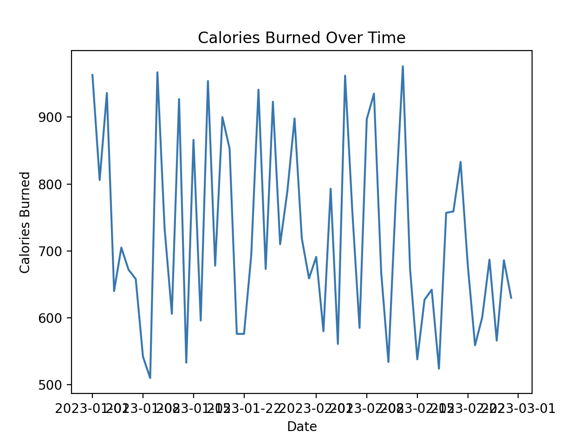

# Exercise Recommendation System

This is a Python code that helps users create a personalized workout plan based on their personal information and workout preferences. It also includes a linear regression model to predict the number of calories burned during a workout and a graph to track the user's progress over time.

## Prerequisites

This code requires the following libraries to be installed:

* pandas
* numpy
* sklearn
* matplotlib

## Usage

1. Load the exercise dataset by running the following command:

```
exercise_data = pd.read_csv('exercise_data.csv')
```
2. Enter your personal information:

```
age = input('Please enter your age: ')
height = input('Please enter your height (in centimeters): ')
weight = input('Please enter your weight (in kilograms): ')
```
3. Create a user profile based on the user's personal information:

```
user_profile = {
    'age': int(age),
    'height': int(height),
    'weight': int(weight)
}
```
4. Enter your workout preferences:

```
muscle_group = input('Which muscle group would you like to target? ')
num_sets = input('How many sets would you like to do? ')
num_reps = input('How many reps would you like to do per set? ')
```
5. Convert the input values to numeric data types:

```
weight = float(weight)
num_sets = int(num_sets)
num_reps = int(num_reps)
```
6. Create a workout plan based on the user's preferences and body type:

```
workout_plan = exercise_data[(exercise_data['muscle_group'] == muscle_group) & (exercise_data['weight'] <= user_profile['weight'])]
```

7. Shuffle the workout plan:

```
workout_plan = workout_plan.sample(frac=1)
```
8. Split the workout plan into training and testing sets:

```
train, test = train_test_split(workout_plan, test_size=0.2)
```
9. Create a linear regression model:

```
model = LinearRegression()
```
10. Train the model on the training data:

```
model.fit(train[['weight', 'num_sets', 'num_reps']].astype(float), train['calories_burned'])
```
11. Test the model on the testing data:

```
score = model.score(test[['weight', 'num_sets', 'num_reps']].astype(float), test['calories_burned'])
```
12. Print the model score:

```
print('Model score:', score)
```
13. Create a graph to show the user's progress over time:

```
dates = pd.date_range(start='2023-01-01', end='2023-02-28', freq='D')
calories_burned = np.random.randint(500, 1000, size=len(dates))

plt.plot(dates, calories_burned)
plt.title('Calories Burned Over Time')
plt.xlabel('Date')
plt.ylabel('Calories Burned')
plt.show()
```

## Example

This code generates a line plot that shows the user's progress over time in terms of the calories burned. The **'plt.plot()'** function generates the line plot, using dates as the x-axis and calories_burned as the y-axis. The **'plt.title()'**, **'plt.xlabel()'**, and **'plt.ylabel()'** functions are used to add a title, x-axis label, and y-axis label to the plot, respectively.



## Note 

The exercise dataset (exercise_data.csv) should contain the following columns:

* exercise
* muscle_group
* weight
* num_sets
* num_reps
* calories_burned

This code assumes that the dataset is structured in this way. If your dataset has different column names or structures, you may need to modify the code accordingly.

## Contributing

Contributions are welcome! If you'd like to contribute to this project, please create a pull request with your proposed changes.

## License

This project is licensed under the terms of the MIT license.
